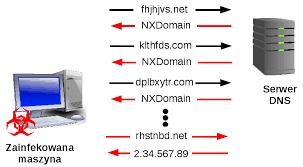

## DGA域名检测
### 前言
DGA (Domain Generation Algorithm) 多用于僵尸网络中，集中式命令和控制 (C＆C) 服务器需要与受感染的主机进行通信，最简单的方法就是通过域名或 ip 地址，然而这种方法很容易被发现（阻止特定 ip 的流量，将域名/ ip 加入黑名单）。所以，反过来，不在受感染主机中硬编码服务器的域名或 ip 地址，而是通过让受感染的主机用 DGA 算法生成大量可能的域名，通过解析这些域名来获取服务器的真实地址。

DNS 解析中的 NXDOMAIN 响应是域名不存在(domain does not exist)的意思，受感染的主机不断尝试解析域名，直到域名解析成功返回 ip 地址，从而达到访问 C&C 服务器的目的。
- DNS 劫持：将 DNS 解析重定向到另一个域名服务器或 Web 服务器

顺带一提，受感染的主机大多都是被安装了恶意软件的，上述通信方式应该就是恶意软件中集成的功能。

### 实现

一开始，想着使用 DGA 生成大量域名，稍微研究了一下 DGA 算法发现实现方法各种各样，从一些特定的实现中甚至可以推测出域名应有的特征（比如某些字母完全没用于生成域名）。但是这是针对已知的算法的分析，并不具有一般性，因此后来选择直接使用网上的数据集。

总体步骤如下：
1. 清理数据
2. 特征提取
3. 交叉验证
4. 随机森林模型训练
5. 测试模型

#### 清理数据
其实就是提取域名，舍弃了顶级域名(TLD)
- DGA 的顶级域名一般不常见，但从数据集中看来并不是这样
- DGA 的域名一般都比较长，而且奇怪（可读性差）

#### 特征提取
这个完全是开脑洞，在人工智能课里听过一些 orz（此时体现了数学的重要性）
- 长度
- 香农熵
- n元语法
- 字典语法
- 元音字母占比
- 辅音字母占比
- 数字占比
- 非字母数字占比

#### 交叉验证
听说交叉验证可以用于判断特征选取得是否合适，二话不说，开始枚举特征组合
- 结果基本上就是全特征最好

#### 随机森林模型训练
使用 sklearn 中的函数，基本上就是“开箱即用”，封装好的函数调用一下
- 分割训练集和测试集
- 选择特征，训练模型

#### 测试模型
计算出域名的特征，然后使用模型进行预测
- 使用了另一个训练集进行测试，发现全特征的准确率仅 50 %
- 回炉重造（暴力枚举特征训练测试）

### [实验结果](dga.ipynb)

微妙，相当微妙。
- 我需要重新学一下数学
- 我需要重新学一下Python

### 参阅
##### 概念相关
- [Domain generation algorithm](https://en.wikipedia.org/wiki/Domain_generation_algorithm)
- [Precision and recall](https://en.wikipedia.org/wiki/Precision_and_recall)
- [在统计学中为什么要对变量取对数?](https://www.zhihu.com/question/22012482)
- [Document-term matrix](https://en.wikipedia.org/wiki/Document-term_matrix)
- [What Is NXDOMAIN?](https://www.dnsknowledge.com/whatis/nxdomain-non-existent-domain-2/)
- [DNS hijacking](https://en.wikipedia.org/wiki/DNS_hijacking)
- [Detecting DGA domains with recurrent neural networks and side information](https://arxiv.org/pdf/1810.02023.pdf)
- [PRNG-based DGA methodology](https://blogs.akamai.com/2018/01/a-death-match-of-domain-generation-algorithms.html)
- [Precision and recall](https://en.wikipedia.org/wiki/Precision_and_recall)

##### 实现相关
- [c4pr1c3/data_hacking](https://github.com/c4pr1c3/data_hacking)
- [Building a DGA Classifier](http://datadrivensecurity.info/blog/posts/2014/Sep/dga-part1/)
- [what is the difference between 'transform' and 'fit_transform' in sklearn](https://stackoverflow.com/questions/23838056/what-is-the-difference-between-transform-and-fit-transform-in-sklearn)
- [Feature Extraction from Text](https://andhint.github.io/machine-learning/nlp/Feature-Extraction-From-Text/)
- [What does “fit” method in scikit-learn do? [closed]](https://stackoverflow.com/questions/45704226/what-does-fit-method-in-scikit-learn-do)
- [An introduction to machine learning with scikit-learn](https://scikit-learn.org/stable/tutorial/basic/tutorial.html)
- [3.2.4.3.1. sklearn.ensemble.RandomForestClassifier](https://scikit-learn.org/stable/modules/generated/sklearn.ensemble.RandomForestClassifier.html)
- [sklearn.model_selection.cross_val_score](https://scikit-learn.org/stable/modules/generated/sklearn.model_selection.cross_val_score.html)
- [cross_val_score交叉验证及其用于参数选择、模型选择、特征选择](https://blog.csdn.net/weixin_38536057/article/details/78702564)
- [operator.itemgetter](https://docs.python.org/3.7/library/operator.html#operator.itemgetter)
- [Calling pylab.savefig without display in ipython](https://stackoverflow.com/questions/15713279/calling-pylab-savefig-without-display-in-ipython)
- [Precision-Recall](https://scikit-learn.org/stable/auto_examples/model_selection/plot_precision_recall.html#sphx-glr-auto-examples-model-selection-plot-precision-recall-py)
- [What does calling fit() multiple times on the same model do?](https://stackoverflow.com/questions/49841324/what-does-calling-fit-multiple-times-on-the-same-model-do)

##### 数据集
- [Alexa Top 1 Million - The static 1 million most popular sites by Alexa](http://s3.amazonaws.com/alexa-static/top-1m.csv.zip)
- [Domain feed of known DGA domains from -2 to +3 days](http://osint.bambenekconsulting.com/feeds/dga-feed.txt)
- [Gameover Zeus DGA sample 31000 DGA domains from Dec 2014](https://www.secrepo.com/misc/zeus_dga_domains.txt.zip)
- [data_hacking/dga_detection/data/](https://github.com/SuperCowPowers/data_hacking/tree/master/dga_detection/data)
- [DDS legit and DGA labeled domains - DDS Blog](http://datadrivensecurity.info/blog/data/2014/10/legit-dga_domains.csv.zip)
- [Cisco Umbrella Popularity List - Top 1 million most daily popular domains](https://s3-us-west-1.amazonaws.com/umbrella-static/index.html)

##### DGA 算法
- [baderj/domain_generation_algorithms](https://github.com/baderj/domain_generation_algorithms)
- [andrewaeva/DGA](https://github.com/andrewaeva/DGA)